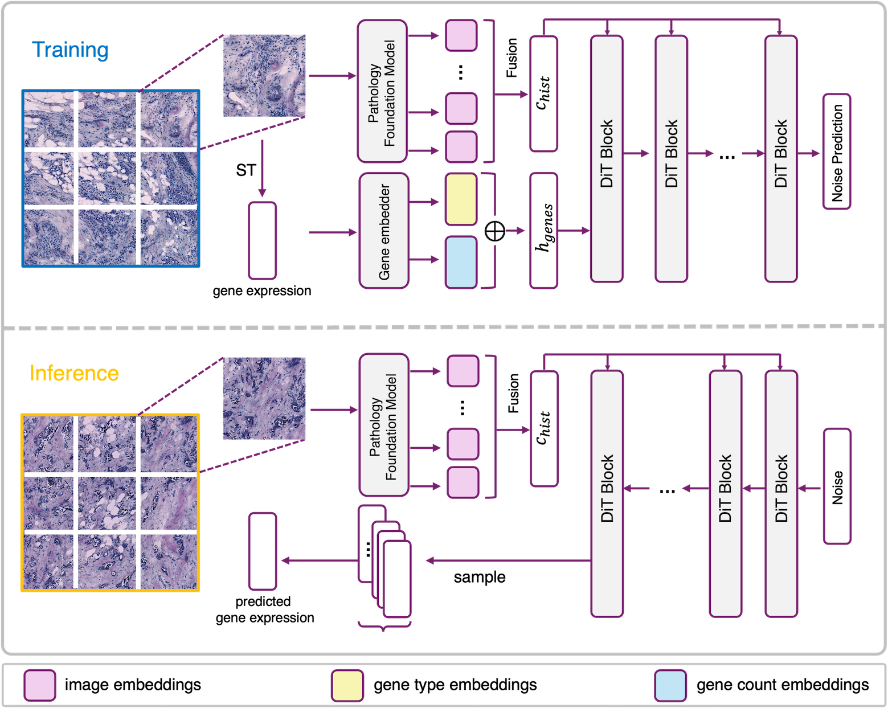

# Stem

[](LICENSE)
[](https://arxiv.org/abs/2501.15598)


Welcome to the official repository for **Stem** proposed in "Diffusion Generative Modeling for Spatially Resolved Gene Expression Inference from Histology Images."  



## Installation
Download this repo:
```
git clone https://github.com/SichenZhu/Stem.git
cd Stem
```
Create a new conda environment:
```
conda env create -f environment.yml
conda activate stem_env
```


## Preparing Datasets:
All the datasets used in paper could be downloaded from the [HEST](https://github.com/mahmoodlab/HEST) database.
Run [dataset_download_hest1k.ipynb](dataset_download_hest1k.ipynb) to download datasets and [dataset_preprocess.ipynb](dataset_preprocess.ipynb) to preprocess the data.

## Training and Sampling:
To train **Stem**:
```
torchrun --nnodes=1 --nproc_per_node=1 --master_port=29501 stem_train.py
```

Sampling after training:
```
python stem_sample.py
```

## Evaluation:
Run [eval.ipynb](eval.ipynb) to calculate different evalutaion metrics and visualize gene variation curves.


## Latest Update
[Jan 22, 2025] Stem was accepted to ICLR 2025.

